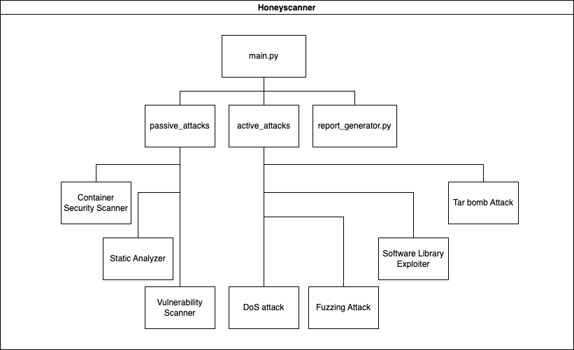

<div align="center">
    
</div>

<br />

<div align="left">
    
</div>

This project was supported and funded by Google Summer of Code 2023. For more information about Honeyscanner in GSoC2023 click [here](https://summerofcode.withgoogle.com/archive/2023/projects/6oyTxlUo).

<br />

<div align="left">
    
</div>

This project was presented at BlackHat Europe 2023 in London. For more information about Honeyscanner in BlackHat Europe click [here](https://www.blackhat.com/eu-23/arsenal/schedule/index.html#honeyscanner-a-vulnerability-analyzer-for-honeypots-35048).
# Honeyscanner - A vulnerability analyzer for Honeypots

[](https://www.python.org/downloads/release/python-3912/)
[](https://pipenv.pypa.io/)
[](https://github.com/honeynet/honeyscanner/blob/main/LICENSE)
[](https://github.com/honeynet/honeyscanner/issues)

Honeyscanner is a vulnerability analyzer for honeypots designed to automatically attack a given honeypot, in order to determine if the honeypot is vulnerable to specific types of cyber attacks. It uses a variety of attacks, ranging from exploiting vulnerable software libraries to DoS, and fuzzing attacks. The analyzer then provides an evaluation report to the honeypot administrator, offering advice on how to enhance the security of the honeypot. Targeted toward security enthusiasts, open-source communities, and companies, Honeyscanner provides a much needed safety check for various honeypots.

### Video showcasing Honeyscanner against Cowrie v2.5.0

<a href="https://www.youtube.com/watch?v=RHC3f67Ae6c" target="_blank"></a>

### Architecture

<div align="center">
    
</div>

### References

Inspiration for Honeyscanner were the following research papers.

\[1\]   [Alexander Vetterl, Richard Clayton: "Bitter Harvest: Systematically Fingerprinting Low- and Medium-interaction Honeypots at Internet Scale"](https://www.usenix.org/conference/woot18/presentation/vetterl)

\[2\]   [Shreyas Srinivasa, Jens Myrup Pedersen, Emmanouil Vasilomanolakis: "Gotta catch 'em all: a Multistage Framework for honeypot fingerprinting"](https://arxiv.org/abs/2109.10652)

\[3\]   [Shreyas Srinivasa, Dimitrios Georgoulias, Jens Myrup Pedersen, Emmanouil Vasilomanolakis: "A Bad IDEa: Weaponizing uncontrolled online-IDEs in availability attacks"](https://ieeexplore.ieee.org/document/9799405)

## Installation

The following instructions will guide you through the process of setting up Honeyscanner on your local machine.

### Requirements

- Python v3.10.12 - Required to run the project
- Pipenv v2023.12.1 - Required to install Python dependencies
- Git - Used to download the source code

---

1. Download the Honeyscanner source code from GitHub. Open a tarminal and introduce the following command.

    ```bash
    git clone https://github.com/honeynet/honeyscanner.git
    ```

2. Navigate to the Honeyscanner's folder, install the required Python packages and activate the virtual environment.

    ```bash
    cd Honeyscanner/honeyscanner
    pipenv install
    pipenv shell
    ```

> **__NOTE FOR PIPENV__:** To exit the virtual environment, you just need to enter the command "<i>exit</i>" in the terminal.

## Configuration

- Before you run Honeyscanner, you need to control or own a Honeypot instance. For testing purposes, this guide assumes that the targeted Honeypot runs on a Docker container on the local machine, where Honeyscanner runs.

- To test Honeyscanner against the latest [Cowrie](https://github.com/cowrie/cowrie) version, you can use the official Docker Image [here](https://hub.docker.com/r/cowrie/cowrie), pull it locally and run a Docker container with it.

- If you prefer to test Honeyscanner against [Kippo](https://github.com/desaster/kippo), you can use the following Docker Image in DockerHub [here](https://hub.docker.com/r/aristofanischionis/kippo).

- For testing Honeyscanner against [Dionaea](https://github.com/DinoTools/dionaea), use the following Docker Image in DockerHub [here](https://hub.docker.com/r/dinotools/dionaea).

- For testing Honeyscanner against [Conpot](https://github.com/mushorg/conpot), use the following Docker Image in DockerHub [here](https://hub.docker.com/r/honeynet/conpot).

- After running a Honeypot using Docker containers locally, you will be able to specify the following parameters: `--target_ip 127.0.0.1 --port 2222` when running the Honeyscanner.

> **__NOTE__:** NEVER RUN `Honeyscanner` AGAINST HONEYPOTS YOU DO NOT OWN, OR YOU DO NOT HAVE EXPLICIT PERMISSION TO TEST.

> **__NOTE__:** Currently `Honeyscanner` can actively attack the `Dionaea` and the `Conpot` honeypots only by using the DoS attack module. The way it works is that initially `Honeyscanner` uses nmap to find the open ports on the targeted honeypot, then tries to DoS all ports simultaneously. In order to run the nmap scanner, run `Honeyscanner` with root privileges for scanning `Dionaea` and `Conpot`. This provides nmap with deeper view of the services that run behind each port on the honeypot.

> **__NOTE__:** For `Dionaea` only version 0.11.0 is supported at this stage of `Honeyscanner`. For `Conpot`, all versions up to `0.6.0` are supported.

## Usage

Use the following examples as a reference for how to run `Honeyscanner`:

```bash
python3 main.py --honeypot cowrie --honeypot_version 2.5.0 --target_ip 127.0.0.1 --port 2222 --username root --password 1234
```
```bash
python3 main.py --honeypot kippo --honeypot_version 0.9 --target_ip 127.0.0.1 --port 2222
```
```bash
sudo python3 main.py --honeypot dionaea --honeypot_version 0.11.0 --target_ip 127.0.0.1 --port 2323
```
```bash
sudo python3 main.py --honeypot conpot --honeypot_version 0.6.0 --target_ip 127.0.0.1 --port 2323
```

## Contributors

For information on Contributors and How to contribute see our [Contributors file](./CONTRIBUTORS.md).

## Versioning

The [SemVer](http://semver.org/spec/v2.0.0.html) is used for versioning. For the latest available version of Honeyscanner, see page [releases](https://github.com/honeynet/honeyscanner/releases).

## Release History

Honeyscanner does not have any release yet.

## Contact

Please use [Github issues](https://github.com/honeynet/honeyscanner/issues) to report any issues or for questions.

## License

Distributed under the **MIT license**. See [LICENSE](./LICENSE) for more information.
