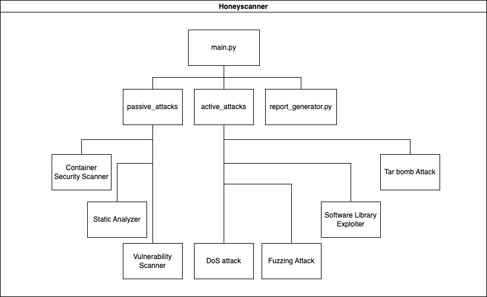

<div align="center">
    
</div>

# Honeyscanner - A vulnerability analyzer for Honeypots

Honeyscanner is a vulnerability analyzer for honeypots. It is designed to automatically attack a given honeypot, in order to determine if the honeypot is vulnerable to specific types of cyber attacks. The analyzer uses a variety of attacks, ranging from exploiting vulnerable software libraries to DoS, and fuzzing attacks. In the end, an evaluation report is provided to the honeypot administrator, including advice on how to enhance the security of the honeypot.

## Synopsis

A honeypot is a security resource that mimics a vulnerable system and is used to lure and trap cyber-attackers. Over the last decade, many open-source honeypots have been developed by the community as side projects without any funding or company behind them. This led to experimental implementations of honeypot ideas, that haven't been tested by security teams thoroughly. This tool comes to solve this exact problem. Honeyscanner is an open-source vulnerability scanner for honeypots. Equipped with a penetration testing strategy that starts from reconnaissance techniques to more advanced ones like exploiting bugs in libraries used by the honeypot, fuzzing and DoS attacks. The tool is written in Python.

### Architecture

<div align="center">
    
</div>

### References

Inspiration for Honeyscanner were the following research papers.

\[1\]   [Alexander Vetterl, Richard Clayton: "Bitter Harvest: Systematically Fingerprinting Low- and Medium-interaction Honeypots at Internet Scale"](https://www.usenix.org/conference/woot18/presentation/vetterl)

\[2\]   [Shreyas Srinivasa, Jens Myrup Pedersen, Emmanouil Vasilomanolakis: "Gotta catch 'em all: a Multistage Framework for honeypot fingerprinting"](https://arxiv.org/abs/2109.10652)

\[3\]   [Shreyas Srinivasa, Dimitrios Georgoulias, Jens Myrup Pedersen, Emmanouil Vasilomanolakis: "A Bad IDEa: Weaponizing uncontrolled online-IDEs in availability attacks"](https://ieeexplore.ieee.org/document/9799405)

## Getting Started

Running Honeyscanner is easy. This guide will help you run Honeyscanner from source.

<details open>
    <summary><b>Build it yourself</b></summary>

> **_Info_:** This guide is meant for advanced users comfortable in development environments.

<blockquote>
<details>
<summary><b>Requirements</b></summary>

- Python v3.9.12 - Required to run the project

**Optional**:

- Git - Used to download the source code

</details>
</blockquote>

---

1. Download the Honeyscanner source code from GitHub. Open a console and introduce the following line.

    ```bash
    git clone https://github.com/honeynet/honeyscanner.git
    ```

2. Navigate to the Honeyscanner's folder and install the required Python packages.

    ```bash
    .... TODO:
    ```

3. Before you run Honeyscanner you need to control or own a Honeypot instance. For testing purposes, this guide assumes that the targeted Honeypot run on a Docker container on the local machine, where Honeyscanner runs.
4. For example, if you want to test Honeyscanner against the latest [Cowrie](https://github.com/cowrie/cowrie) version, you can use the official Docker Image [here](https://hub.docker.com/r/cowrie/cowrie), pull it locally and run a Docker container with it.
5. If you prefer to test Honeyscanner against [Kippo](https://github.com/desaster/kippo), you can use the following Docker Image in DockerHub [here](https://hub.docker.com/r/aristofanischionis/kippo)
6. After running a Honeypot using Docker containers locally, you will be able to specify the following parameters: `--target_ip 127.0.0.1 --port 2222`.
7. Run Honeyscanner as seen [here](#usage-examples)

> **__NOTE 1__:** Honeyscanner uses `pipenv` to handle the project's dependencies.
> 
> **__NOTE 2__:** NEVER RUN `Honeyscanner` AGAINST HONEYPOTS YOU DO NOT OWN, OR YOU DO NOT HAVE EXPLICIT PERMISSION TO TEST

</details>

## Usage examples

```bash
python3 main.py --honeypot cowrie --honeypot_version 2.5.0 --target_ip 127.0.0.1 --port 2222 --username root --password 1234
```
```bash
python3 main.py --honeypot kippo --honeypot_version 0.9 --target_ip 127.0.0.1 --port 2222
```

## Contributors

For information on Contributors and how to contribute see our [Contributors file](./CONTRIBUTORS.md).

## Versioning

The [SemVer](http://semver.org/spec/v2.0.0.html) is used for versioning. For the latest available version of Honeyscanner, see page [releases](https://github.com/honeynet/honeyscanner/releases).

## Release History

Honeyscanner does not have any release yet.

## GSoC 2023

The project was actively developed with participation in Google Summer of Code 2023. More information about Honeyscanner in GSoC2023 [here](https://summerofcode.withgoogle.com/archive/2023/projects/6oyTxlUo)

## Contact

Please use Github issues to report any issues or for questions.

## License

Distributed under the **MIT license**. See [LICENSE](./LICENSE) for more information.